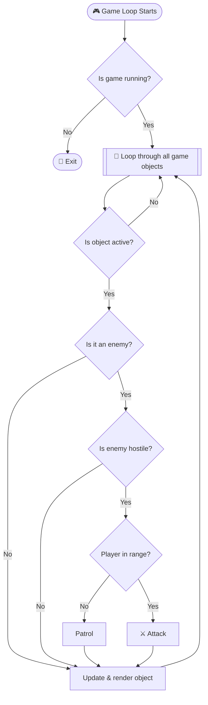

| Back | Index | Next |
| ------- | ------ | ------ |
| [OOP](https://moopa01.opencodingsociety.com/OOP) | [Index](https://moopa01.opencodingsociety.com/) | [Data Types](https://moopa01.opencodingsociety.com/data) |


---

<div id="control-app" style="font-family: 'Segoe UI', Arial, sans-serif; max-width: 650px; background: #1a1a1a; padding: 20px; border-radius: 8px; border: 1px solid #333; color: #e0e0e0;">
  <h2 style="margin-top: 0; color: #00ddff;">Control Structures</h2>
  <p style="color: #bbbbbb;">Click a category to see examples and game use cases.</p>

  <div id="control-list"></div>
</div>

<script>
// ----------------------
// DATA: Fixed Brackets & Braces
// ----------------------
const controlStructures = [
  {
    name: "Iteration (Loops)",
    description: `
      <strong style="color: #00ddff;">How it works:</strong> Repeats code while a condition is met.<br>
      <code style="background: #2a2a2a; color: #f8f8f2; padding: 2px 4px;">for (let i = 0; i < 5; i++)</code> <br>
      <strong>Game Use:</strong> Updating all 60 sprites every frame or checking collisions in a list.
    `
  },
  {
    name: "Conditions (If / Else)",
    description: `
      <strong style="color: #00ddff;">How it works:</strong> Branches logic based on true/false checks.<br>
      <code style="background: #2a2a2a; color: #f8f8f2; padding: 2px 4px;">if (health <= 0) { die(); }</code> <br>
      <strong>Game Use:</strong> Triggering a 'Game Over' screen or handling keyboard input.
    `
  },
  {
    name: "Nested Conditions",
    description: `
      <strong style="color: #00ddff;">How it works:</strong> Places checks inside checks for complex logic.<br>
      <pre style="background:#2a2a2a; color: #f8f8f2; padding:8px; margin-top:5px; border-radius:4px; font-size:12px; border: 1px solid #444;">if (enemy.isHostile) {
  if (distance < 50) {
    enemy.attack();
  }
}</pre>
      <strong>Game Use:</strong> Advanced AI (e.g., "If enemy is alert AND player is in range").
    `
  }
]; // Array properly closed

// ----------------------
// RENDER: Clean Dark Logic
// ----------------------
const controlContainer = document.getElementById("control-list");

controlStructures.forEach((item, index) => {
  const wrapper = document.createElement("div");
  wrapper.style.marginBottom = "8px";

  const button = document.createElement("button");
  button.textContent = `${index + 1}. ${item.name}`;
  button.style.cssText = `
    width: 100%;
    padding: 12px;
    text-align: left;
    cursor: pointer;
    border: 1px solid #00ddff;
    border-radius: 4px;
    background: #1a1a1a;
    color: #00ddff;
    font-size: 16px;
    font-weight: bold;
    transition: all 0.2s ease;
  `;

  const details = document.createElement("div");
  details.style.display = "none";
  details.style.padding = "10px";
  details.style.border = "1px solid #ddd";
  details.style.borderTop = "none";
  details.style.background = "#fff";
  details.style.lineHeight = "1.6";
  details.innerHTML = item.description;

  button.addEventListener("click", () => {
    const isOpen = details.style.display === "block";
    details.style.display = isOpen ? "none" : "block";
    button.style.borderRadius = isOpen ? "4px" : "4px 4px 0 0";
    button.style.background = isOpen ? "#1a1a1a" : "#4692a7";
    button.style.color = isOpen ? "#00ddff" : "white";
  });

  wrapper.appendChild(button);
  wrapper.appendChild(details);
  controlContainer.appendChild(wrapper);
}); // Loop properly closed
</script>

---

# Control Structures in Programming

Control structures determine **how**, **when**, and **how many times** code runs. They're what make games feel alive — without them, code executes top-to-bottom with no branching, repeating, or reacting.

---

## How They Work Together



---

## The Three Core Structures

### 🔁 Iteration — *Repeat*
Loops run code multiple times, so you don't repeat yourself.

| Loop | Use when… |
|------|-----------|
| `for` | You know the count upfront |
| `while` | You repeat until a condition changes |
| `for...of` | You're walking through an array |

**In games:** updating sprites, checking collisions, running AI, processing inventory.

---

### Conditions — *Decide*
`if / else` lets code react to what's actually happening.

```js
if (health <= 0)       { die(); }
else if (health < 25)  { playWarning(); }
else                   { continue(); }
```

**In games:** state changes, input handling, damage, win/lose logic, AI reactions.

---

### Nested Conditions — *Refine*
Conditions inside conditions handle layered, real-world logic.

```js
if (enemy.isHostile) {
    if (distance < 50) {
        enemy.attack();  // only if BOTH are true
    }
}
```

**In games:** AI decision trees, proximity checks, multi-state interactions.

---

## Quick Reference

| Structure | Keyword | Purpose |
|-----------|---------|---------|
| Iteration | `for`, `while`, `for...of` | Repeat actions |
| Condition | `if`, `else if`, `else` | Branch on truth |
| Nested condition | `if` inside `if` | Layer decisions |

> **Rule of thumb:** If something needs to *repeat*, use a loop. If something needs to *choose*, use a condition. If the choice depends on *another* choice, nest them.