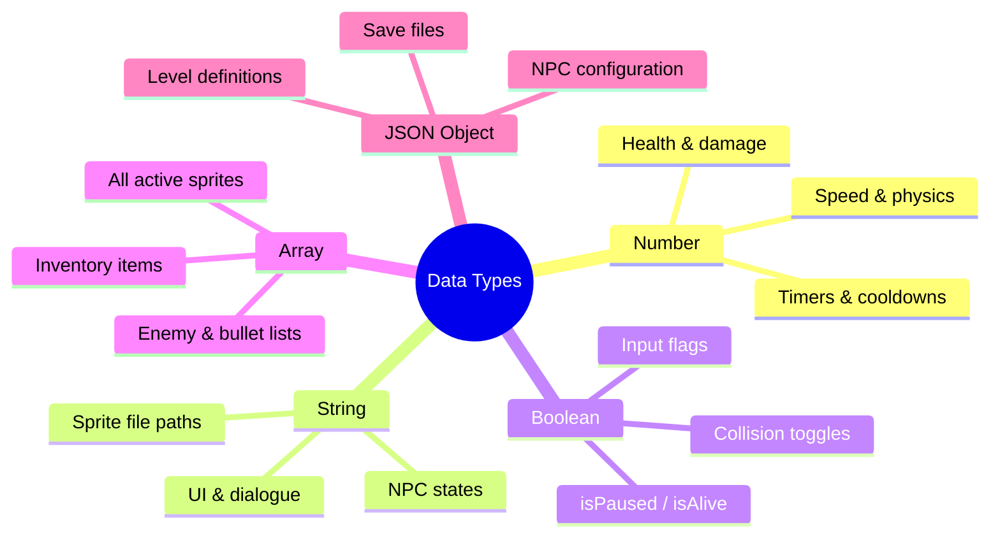

| Back | Index | Next |
| ------- | ------ | ------ |
| [Control Structures](https://moopa01.opencodingsociety.com/controlStructures) | [Index](https://moopa01.opencodingsociety.com/) | [Operators](https://moopa01.opencodingsociety.com/operators) |


---


<div id="datatype-app" style="font-family: 'Segoe UI', Arial, sans-serif; max-width: 650px; background: #1a1a1a; padding: 20px; border-radius: 8px; border: 1px solid #333; color: #e0e0e0;">
  <h2 style="margin-top: 0; color: #f700ff;">Data Types</h2>
  <p style="color: #bbbbbb;">Click a type to see how it's used in game logic.</p>

  <div id="datatype-list"></div>
</div>

<script>
// ----------------------
// DATA TYPES: Fixed Syntax
// ----------------------
const dataTypes = [
  {
    type: "Number",
    example: "velocity: 3",
    usage: "Handling physics, health points, and movement speed."
  },
  {
    type: "String",
    example: '"hostile"',
    usage: "Defining NPC states, sprite file paths, and UI text."
  },
  {
    type: "Boolean",
    example: "isPaused: true",
    usage: "Binary flags for game logic (e.g., isJumping, isAlive)."
  },
  {
    type: "Array",
    example: "gameObjects[]",
    usage: "Storing lists of enemies, bullets, or inventory items."
  },
  {
    type: "JSON Object",
    example: '{ hitbox: { width: 40 } }',
    usage: "Complex configurations for NPCs or level settings."
  }
]; // Array properly closed

// ----------------------
// RENDER: Neon Dark Mode
// ----------------------
const dtContainer = document.getElementById("datatype-list");

dataTypes.forEach((item, index) => {
  const wrapper = document.createElement("div");
  wrapper.style.marginBottom = "8px";

  // Styled Button
  const button = document.createElement("button");
  button.textContent = `${index + 1}. ${item.type}`;
  button.style.cssText = `
    width: 100%;
    padding: 12px;
    text-align: left;
    cursor: pointer;
    border: 1px solid #f700ff;
    border-radius: 4px;
    background: #1a1a1a;
    color: #f700ff;
    font-size: 16px;
    font-weight: bold;
    transition: all 0.2s ease;
  `;

  // Content Box (Fixed visibility)
  const details = document.createElement("div");
  details.style.display = "none";
  details.style.padding = "10px";
  details.style.border = "1px solid #ddd";
  details.style.borderTop = "none";
  details.style.background = "#fff";
  details.style.lineHeight = "1.6";

  details.innerHTML = `
    <p><strong>Example:</strong> <code>${item.example}</code></p>
    <p><strong>Where Used:</strong> ${item.usage}</p>
  `;

  // Hover and Click Logic
  button.onmouseover = () => {
    button.style.background = "#c020a0";
    button.style.color = "white";
  };
  button.onmouseout = () => {
    if (details.style.display !== "block") {
      button.style.background = "#1a1a1a";
      button.style.color = "#f700ff";
    }
  };

  button.addEventListener("click", () => {
    const isOpen = details.style.display === "block";
    details.style.display = isOpen ? "none" : "block";
    button.style.borderRadius = isOpen ? "4px" : "4px 4px 0 0";
    button.style.background = isOpen ? "#1a1a1a" : "#c020a0";
    button.style.color = isOpen ? "#f700ff" : "white";
  });

  wrapper.appendChild(button);
  wrapper.appendChild(details);
  dtContainer.appendChild(wrapper);
}); // Loop properly closed
</script>

---

# Data Types in Programming

Data types define **what kind of information** your code works with — and how it behaves. Choosing the right one affects performance, readability, and how cleanly your systems talk to each other.

---

## The Big Picture



---

## The Five Core Types

**Number** — anything that changes over time
```js
velocity: 3
```
Physics, health, movement speed, animation timing, hit detection.

---

**String** — labels, states, and identifiers
```js
state: "hostile"
```
NPC behavior modes, sprite paths, dialogue, item/quest IDs.

---

**Boolean** — on/off switches for game logic
```js
isPaused: true
```
Game loop control, AI flags, visibility, invincibility, input handling.

---

**Array** — ordered lists of related things
```js
gameObjects[]
```
Every active sprite, enemy/bullet/particle groups, inventory, level data.

---

**JSON Object** — structured data with multiple properties
```js
{ hitbox: { width: 40, height: 60 } }
```
NPC configs, level definitions, save files, game settings, dialogue trees.

---

## Choosing the Right Type

| If you need to store… | Use |
|-----------------------|-----|
| A count, position, or measurement | `Number` |
| A name, mode, or file path | `String` |
| A yes/no state | `Boolean` |
| A collection of similar things | `Array` |
| A thing with many properties | `JSON Object` |

> **Common mistake:** using a `String` like `"true"` instead of a `Boolean` `true`. They look similar but behave completely differently in logic checks.