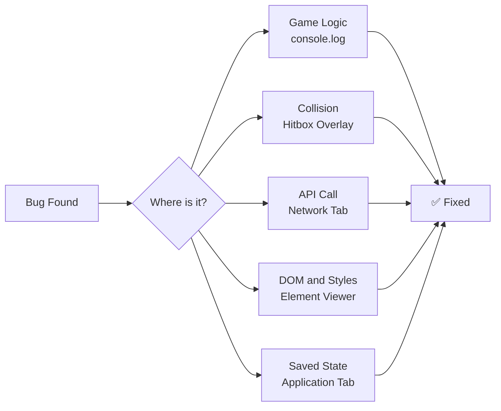

| Back | Index | Next |
| ------- | ------ | ------ |
| [Documentation](https://moopa01.opencodingsociety.com/doc) | [Index](https://moopa01.opencodingsociety.com/) | [Testing & Verification](https://moopa01.opencodingsociety.com/summary) |

---

<div id="debug-app" style="font-family: 'Segoe UI', Arial, sans-serif; max-width: 650px; background: #1a1a1a; padding: 20px; border-radius: 8px; border: 1px solid #333; color: #e0e0e0;">
  <h2 style="margin-top: 0; color: #ff6b35;">Debugging</h2>
  <p style="color: #bbbbbb;">Click a technique to see how it was used in Heist.exe.</p>
  <div id="debug-list"></div>
</div>

<script>
const debugConcepts = [
  {
    name: "Console Debugging",
    description: "Gem.js logs when a gem is created and when it is collected. Guard.js logs its velocity every time it bounces off a wall. heistMusic.js logs the track name on playback and warns if the fetch fails.",
    example: "console.log('Gem created:', this.spriteData?.id, 'at position', this.position);\nconsole.log('Gem collected! +' + this.value + ' | Total: ' + this.gameEnv.stats.coinsCollected);\nconsole.log(this.velocity.y); // Guard bounce\nconsole.warn('Background music: failed to start', error);"
  },
  {
    name: "Hitbox Visualization",
    description: "In HeistL1.js and HeistL3.js, all Barrier objects have visible: true and a semi-transparent green color. This renders the collision zones over the map so you can see exactly where walls and borders are.",
    example: "const border_top = {\n  color: 'rgba(0, 255, 136, 0.5)',\n  visible: true,\n  hitbox: { widthPercentage: 1.0, heightPercentage: 1.0 }\n};"
  },
  {
    name: "Source-Level Debugging",
    description: "Guard.js and Gem.js have strategic console.log calls at key execution points — collision events, velocity reversals, and gem collection — making it easy to set breakpoints in DevTools and step through the exact frame the bug occurs.",
    example: "// Guard.js — set a breakpoint here to inspect collision state\nconsole.log('Collision has occurred, player has been destroyed.');\n\n// Gem.js — breakpoint here to check permanentlyCollected state\nif (this.permanentlyCollected) return;"
  },
  {
    name: "Network Debugging",
    description: "heistMusic.js fetches from the iTunes Search API. It checks response.ok before parsing, and throws a descriptive error if the request fails — making the failure visible in the Network tab.",
    example: "const response = await fetch(this.endpoint);\nif (!response.ok) {\n  throw new Error('API request failed (' + response.status + ')');\n}\nconst data = await response.json();"
  },
  {
    name: "Application Debugging",
    description: "Gem collection totals are tracked in gameEnv.stats.coinsCollected. Boolean flags like permanentlyCollected and isPlaying track game state at runtime — all inspectable in DevTools.",
    example: "// Gem.js — state stored on gameEnv\nthis.gameEnv.stats.coinsCollected = (this.gameEnv.stats.coinsCollected || 0) + this.value;\n\n// heistMusic.js — runtime flags\nthis.started = true;\nthis.isPlaying = true;"
  },
  {
    name: "Element Inspection",
    description: "heistMusic.js dynamically creates a toggle button and appends it to document.body. Gem.js hides its canvas element on collection via canvas.style.display. Both are inspectable in the Elements tab.",
    example: "// heistMusic.js — button added to DOM\ndocument.body.appendChild(btn);\n\n// Gem.js — canvas hidden after collection\nif (this.canvas) this.canvas.style.display = 'none';"
  }
];

const container = document.getElementById("debug-list");

debugConcepts.forEach((item, index) => {
  const wrapper = document.createElement("div");
  wrapper.style.marginBottom = "8px";

  const button = document.createElement("button");
  button.textContent = `${index + 1}. ${item.name}`;
  button.style.cssText = `
    width: 100%;
    padding: 12px;
    text-align: left;
    cursor: pointer;
    border: 1px solid #ff6b35;
    border-radius: 4px;
    background: #1a1a1a;
    color: #ff6b35;
    font-size: 16px;
    font-weight: bold;
    transition: all 0.2s ease;
  `;

  const details = document.createElement("div");
  details.style.cssText = `
    display: none;
    padding: 12px;
    border: 1px solid #333;
    border-top: none;
    background: #1a1a1a;
    color: #e0e0e0;
    font-size: 14px;
    line-height: 1.6;
    border-bottom-left-radius: 4px;
    border-bottom-right-radius: 4px;
  `;
  details.innerHTML = `
    <p>${item.description}</p>
    <pre style="background:#2a2a2a; color:#ff6b35; padding:8px; border-radius:4px; font-size:12px; overflow-x:auto;">${item.example}</pre>
  `;

  button.onmouseover = () => { button.style.background = "#c44a1e"; button.style.color = "white"; };
  button.onmouseout = () => {
    if (details.style.display !== "block") { button.style.background = "#1a1a1a"; button.style.color = "#ff6b35"; }
  };
  button.addEventListener("click", () => {
    const isOpen = details.style.display === "block";
    details.style.display = isOpen ? "none" : "block";
    button.style.borderRadius = isOpen ? "4px" : "4px 4px 0 0";
    button.style.background = isOpen ? "#1a1a1a" : "#c44a1e";
    button.style.color = isOpen ? "#ff6b35" : "white";
  });

  wrapper.appendChild(button);
  wrapper.appendChild(details);
  container.appendChild(wrapper);
});
</script>

---

# Debugging in Heist.exe

Debugging is how you find and fix problems in your code. Across Gem.js, Guard.js, heistMusic.js, and the level files, six different debugging techniques were used.

---



---

## The Six Techniques

**🖨️ Console Debugging** — `Gem.js` · `Guard.js` · `heistMusic.js`
```js
console.log('Gem created:', this.spriteData?.id, 'at position', this.position);
console.log(this.velocity.y); // logs every time Guard bounces
console.warn('Background music: failed to start', error);
```

---

**Hitbox Visualization** — `HeistL1.js` · `HeistL3.js`
```js
const border_top = {
  color: 'rgba(0, 255, 136, 0.5)',
  visible: true,
  hitbox: { widthPercentage: 1.0, heightPercentage: 1.0 }
};
```
All walls and borders rendered as semi-transparent green overlays to verify collision zone placement.

---

**Source-Level Debugging** — `Guard.js` · `Gem.js`
```js
// Breakpoint targets — key state changes
if (this.permanentlyCollected) return;           // Gem.js
console.log("Collision has occurred...");         // Guard.js
```

---

**Network Debugging** — `heistMusic.js`
```js
const response = await fetch(this.endpoint);
if (!response.ok) throw new Error('API request failed (' + response.status + ')');
const data = await response.json();
```

---

**Application Debugging** — `Gem.js` · `heistMusic.js`
```js
this.gameEnv.stats.coinsCollected += this.value; // Gem.js — tracked on gameEnv
this.started = true;                              // heistMusic.js — runtime flag
```

---

**Element Inspection** — `heistMusic.js` · `Gem.js`
```js
document.body.appendChild(btn);             // heistMusic.js — button added to DOM
this.canvas.style.display = 'none';         // Gem.js — canvas hidden on collection
```

---

| Technique | File | DevTools Tab |
|-----------|------|-------------|
| Console Debugging | Gem.js, Guard.js, heistMusic.js | Console |
| Hitbox Visualization | HeistL1.js, HeistL3.js | Canvas overlay |
| Source-Level Debugging | Guard.js, Gem.js | Sources |
| Network Debugging | heistMusic.js | Network |
| Application Debugging | Gem.js, heistMusic.js | Application |
| Element Inspection | heistMusic.js, Gem.js | Elements |

> **Workflow:** start with `console.log` to narrow down where the bug is, then use the matching DevTools tab to go deeper.