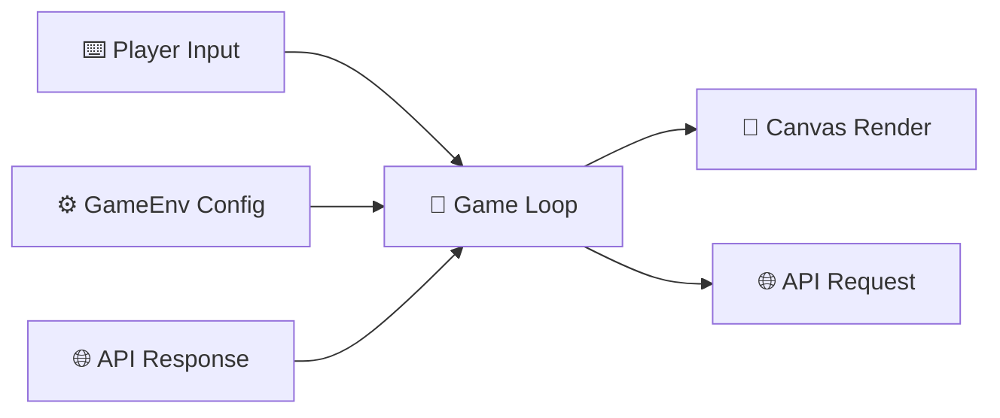

| Back | Index | Next |
| ------- | ------ | ------ |
| [Operators](https://moopa01.opencodingsociety.com/operators) | [Index](https://moopa01.opencodingsociety.com/) | [Debugging](https://moopa01.opencodingsociety.com/debug) |


---


<div id="io-app" style="font-family: 'Segoe UI', Arial, sans-serif; max-width: 650px; background: #1a1a1a; padding: 20px; border-radius: 8px; border: 1px solid #333; color: #e0e0e0;">
  <h2 style="margin-top: 0; color: #8c00ff;">Input / Output</h2>
  <p style="color: #bbbbbb;">Click a category to see how the game communicates.</p>

  <div id="io-list"></div>
</div>

<script>
// ----------------------
// INPUT / OUTPUT DATA: Fixed Syntax
// ----------------------
const ioCategories = [
  {
    name: "Canvas Rendering (Output)",
    description: `
      <strong style="color: #8c00ff;">Visual Layer:</strong> Draws what the player sees every frame.<br>
      <pre style="background:#2a2a2a; color: #f8f8f2; padding:8px; margin-top:5px; border-radius:4px; font-size:12px; border: 1px solid #444;">ctx.fillRect(x, y, w, h);
ctx.drawImage(sprite, x, y);</pre>
      <strong>Game Use:</strong> Rendering sprites, backgrounds, and UI animations.
    `
  },
  {
    name: "Keyboard Events (Input)",
    description: `
      <strong style="color: #8c00ff;">User Control:</strong> Listens for physical key presses.<br>
      <pre style="background:#2a2a2a; color: #f8f8f2; padding:8px; margin-top:5px; border-radius:4px; font-size:12px; border: 1px solid #444;">window.addEventListener("keydown", (e) => {
  if (e.key === " ") player.jump();
});</pre>
      <strong>Game Use:</strong> Movement, jumping, and menu navigation.
    `
  },
  {
    name: "GameEnv Config (Input)",
    description: `
      <strong style="color: #8c00ff;">World Rules:</strong> Sets the global physics and environment.<br>
      <pre style="background:#2a2a2a; color: #f8f8f2; padding:8px; margin-top:5px; border-radius:4px; font-size:12px; border: 1px solid #444;">const gameEnv = {
  gravity: 0.4,
  debug: false
};</pre>
      <strong>Game Use:</strong> Defining world size, gravity, and difficulty settings.
    `
  },
  {
    name: "API Calls (I/O)",
    description: `
      <strong style="color: #8c00ff;">External Data:</strong> Communicates with servers.<br>
      <pre style="background:#2a2a2a; color: #f8f8f2; padding:8px; margin-top:5px; border-radius:4px; font-size:12px; border: 1px solid #444;">fetch("/api/score")
  .then(res => res.json())
  .then(data => show(data));</pre>
      <strong>Game Use:</strong> Leaderboards, cloud saves, and dynamic AI behavior.
    `
  }
]; // Array properly closed

// ----------------------
// RENDER: Purple Neon Dark Mode
// ----------------------
const ioContainer = document.getElementById("io-list");

ioCategories.forEach((item, index) => {
  const wrapper = document.createElement("div");
  wrapper.style.marginBottom = "8px";

  const button = document.createElement("button");
  button.textContent = `${index + 1}. ${item.name}`;
  button.style.cssText = `
    width: 100%;
    padding: 12px;
    text-align: left;
    cursor: pointer;
    border: 1px solid #8c00ff;
    border-radius: 4px;
    background: #1a1a1a;
    color: #8c00ff;
    font-size: 16px;
    font-weight: bold;
    transition: all 0.2s ease;
  `;

  const details = document.createElement("div");
  details.style.cssText = `
    display: none;
    padding: 15px;
    border: 1px solid #333;
    border-top: none;
    background: #222222;
    color: #dddddd;
    font-size: 14px;
    line-height: 1.5;
    border-bottom-left-radius: 4px;
    border-bottom-right-radius: 4px;
  `;
  details.innerHTML = item.description;

  // Hover and Click Logic
  button.onmouseover = () => {
    button.style.background = "#57197d";
    button.style.color = "white";
  };
  button.onmouseout = () => {
    if (details.style.display !== "block") {
      button.style.background = "#1a1a1a";
      button.style.color = "#8c00ff";
    }
  };

  button.addEventListener("click", () => {
    const isOpen = details.style.display === "block";
    details.style.display = isOpen ? "none" : "block";
    button.style.borderRadius = isOpen ? "4px" : "4px 4px 0 0";
    button.style.background = isOpen ? "#1a1a1a" : "#57197d";
    button.style.color = isOpen ? "#8c00ff" : "white";
  });

  wrapper.appendChild(button);
  wrapper.appendChild(details);
  ioContainer.appendChild(wrapper);
}); // Loop properly closed
</script>

---

# Input / Output in Game Development

I/O is how your game **receives** information and **sends** it back out. Every interactive moment runs through this cycle.

---



---

## The Four Systems

**Keyboard Events** `Input`
```js
window.addEventListener("keydown", (e) => {
  if (e.key === " ") player.jump();
});
```
Translates physical key presses into in-game actions. `keydown` fires on press, `keyup` on release. Used for movement, jumping, attacking, and menu navigation.

---

**GameEnv Config** `Input`
```js
const gameEnv = { gravity: 0.4, debug: false };
```
System-level input set once at startup — not from the player, but from your code. Defines canvas size, gravity, physics, difficulty, and asset paths. Everything else builds on top of it.

---

**API Calls** `Input + Output`
```js
fetch("/api/score")
  .then(res => res.json())
  .then(data => show(data));
```
Connects your game to the outside world. Sends data out and receives it back — used for leaderboards, cloud saves, dynamic AI behavior, and multiplayer sync.

---

**Canvas Rendering** `Output`
```js
ctx.fillRect(x, y, w, h);
ctx.drawImage(sprite, x, y);
```
Draws everything the player sees — sprites, backgrounds, UI, effects — every frame. It's the final step in the loop: state gets updated, then canvas draws it.

---

> **The core idea:** Input updates *state*. Output draws *that state*. The game loop is the bridge between the two — running every frame.