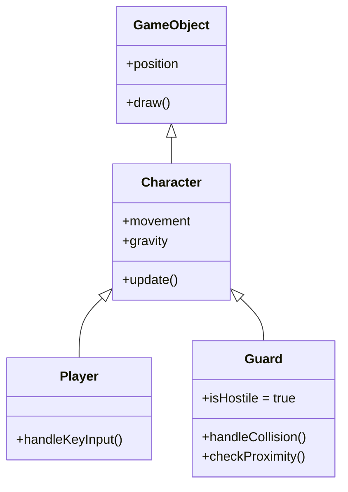

| Back | Index | Next |
| ------- | ------ | ------ |
| [Summary](https://moopa01.opencodingsociety.com/testVerify) | [Index](https://moopa01.opencodingsociety.com/) | [Control Structures](https://moopa01.opencodingsociety.com/controlStructures) |

---


<div id="oop-app" style="font-family: 'Segoe UI', Arial, sans-serif; max-width: 650px; background: #222222; padding: 20px; border-radius: 8px; border: 1px solid #ddd;">
  <h2 style="margin-top: 0; color: #333;">Object-Oriented Programming</h2>
  <p style="color: #666;">Click a concept to expand details.</p>

  <div id="oop-list"></div>
</div>

<script>
// ----------------------
// SHORTENED OOP DATA
// ----------------------
const oopConcepts = [
  {
    name: "Writing Classes",
    description: "A class is a blueprint or template used to create objects. It defines the initial state (properties like health or position) and the behaviors (methods like move or attack) that all objects created from that blueprint will have. It allows you to organize your code into logical, reusable structures."
  },
  {
    name: "Methods & Parameters",
    description: "Methods are functions that live inside a class and represent the actions an object can take. Parameters are the placeholders that allow you to pass specific information into those methods. For example, a jump(height) method uses the height parameter to determine exactly how high that specific jump should be."
  },
  {
    name: "Instantiation & Objects",
    description: "Instantiation is the act of creating a living "copy" of a class in your game’s memory. While the class is just the blueprint, the Object is the actual house built from it. You can instantiate five different "Enemy" objects from one "Enemy" class, and each can have its own unique health and position during gameplay."
  },
  {
    name: "Method Overriding",
    description: "This occurs when a Child class provides a specific implementation of a method that is already defined in its Parent class. For example, if the Parent Enemy has a generic attack() method, the Child Boss can "override" it to perform a much more powerful special attack instead of the default one."
  },
  {
    name: "Constructor Chaining",
    description: "The constructor is a special method that runs automatically when an object is created. Chaining involves using the super() keyword to ensure that the Parent’s constructor runs before the Child’s constructor logic. This ensures the object is properly set up with all basic "Parent" traits before the "Child" adds its unique features."
  }
];

// ----------------------
// RENDER OOP VIEWER
// ----------------------
const oopContainer = document.getElementById("oop-list");

oopConcepts.forEach((concept, index) => {
  const item = document.createElement("div");
  item.style.marginBottom = "8px";

  // Styled Button
  const button = document.createElement("button");
  button.textContent = `${index + 1}. ${concept.name}`;
  button.style.cssText = `
    width: 100%;
    padding: 12px;
    text-align: left;
    cursor: pointer;
    border: none;
    border-radius: 4px;
    background: #cc6516;
    color: white;
    font-size: 16px;
    font-weight: bold;
    transition: background 0.2s ease;
  `;

  // Content Box (Fixed white-on-white)
  const details = document.createElement("div");
  details.style.cssText = `
    display: none;
    padding: 15px;
    border: 1px solid #cc6516;
    border-top: none;
    background: #222222;
    color: #ffffff;
    font-size: 14px;
    line-height: 1.5;
    border-bottom-left-radius: 4px;
    border-bottom-right-radius: 4px;
  `;
  details.textContent = concept.description;

  // Hover and Click Logic
  button.onmouseover = () => button.style.background = "#e67e22";
  button.onmouseout = () => button.style.background = "#cc6516";
  
  button.addEventListener("click", () => {
    const isOpen = details.style.display === "block";
    details.style.display = isOpen ? "none" : "block";
    button.style.borderRadius = isOpen ? "4px" : "4px 4px 0 0";
  });

  item.appendChild(button);
  item.appendChild(details);
  oopContainer.appendChild(item);
});
</script>

# Object-Oriented Programming

OOP organizes code into **classes** — blueprints that bundle data and behavior together. In games, this means building reusable, layered objects like characters, enemies, and items.

---



---

## The Four Pillars

**Encapsulation** — bundle data and behavior into one unit
Each class owns its own properties and methods. Outside code can't accidentally break internal state.
```js
this.type = "Guard";
this.isHostile = true;
```

---

**Inheritance** — child classes reuse parent logic
`Pirate extends Character` means Pirate gets position, sprite, movement, and physics for free — then adds its own behavior on top.
```js
class Guard extends Character { ... }
```

---

**Polymorphism** — child classes override parent behavior
The parent defines `handleCollision()`, but Pirate replaces it with its own hostile logic. Same method name, different behavior.
```js
handleCollision(other, direction) {
    if (other instanceof Player) {
        if (this.distanceTo(other) < 50) {
            this.reaction("hostile");
        }
    }
}
```

---

**Abstraction** — hide complexity, expose only what's needed
`super.update()` runs all parent logic in one call — movement, animation, physics — without the Pirate needing to know how any of it works.
```js
update() {
    super.update();        // all parent logic runs here
    this.checkProximity(); // then add pirate-specific behavior
}
```

---

| Concept | Keyword | What it gives you |
|---------|---------|-------------------|
| Encapsulation | `this.` | Self-contained objects |
| Inheritance | `extends` | Reusable parent logic |
| Polymorphism | method override | Custom behavior per class |
| Abstraction | `super()` | Simplified interface to complex logic |

> **Pattern to remember:** call `super()` first to keep parent behavior, then add your own. Extend — don't replace.