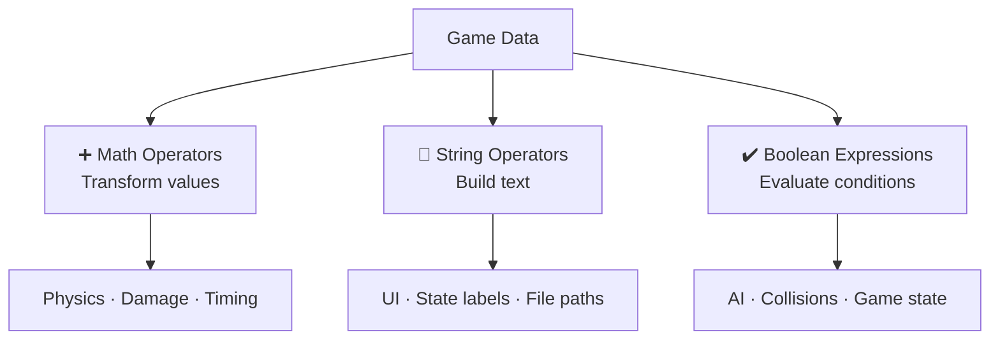

  | Back | Index | Next |
  | ------- | ------ | ------ |
  | [Data Types](https://moopa01.opencodingsociety.com/data) | [Index](https://moopa01.opencodingsociety.com/) | [Input/Output](https://moopa01.opencodingsociety.com/io) |

  ---

  <div id="operators-app" style="font-family: 'Segoe UI', Arial, sans-serif; max-width: 650px; background: #1a1a1a; padding: 20px; border-radius: 8px; border: 1px solid #333; color: #e0e0e0;">
    <h2 style="margin-top: 0; color: #ffea04;">Operators</h2>
    <p style="color: #bbbbbb;">Click a category to see operators in action.</p>

    <div id="operators-list"></div>
  </div>

  <script>
  // ----------------------
  // OPERATORS DATA: Fixed Syntax
  // ----------------------
  const operatorCategories = [
    {
      name: "String Operations",
      description: `
        <strong style="color: #ffea04;">Concatenation:</strong> <code>"Hi " + name</code><br>
        <strong style="color: #ffea04;">Template Literals:</strong> <code>\`HP: \${hp}\`</code><br>
        <strong style="color: #ffea04;">Access:</strong> <code>"wolf"[0]</code> → "w"<br>
        <strong>Game Use:</strong> Building dynamic UI text, file paths, and NPC state labels.
      `
    },
    {
      name: "Mathematical Operations",
      description: `
        <strong style="color: #ffea04;">Basic:</strong> <code>+</code>, <code>-</code>, <code>*</code>, <code>/</code><br>
        <strong style="color: #ffea04;">Modulo:</strong> <code>frame % 60</code> (Great for timing!)<br>
        <strong>Game Use:</strong> Movement physics, damage calculations, and animation frame logic.
      `
    },
    {
      name: "Boolean Expressions",
      description: `
        <strong style="color: #ffea04;">Logic:</strong> <code>&&</code> (AND), <code>||</code> (OR), <code>!</code> (NOT)<br>
        <strong style="color: #ffea04;">Comparison:</strong> <code>===</code>, <code>></code>, <code><</code><br>
        <strong>Game Use:</strong> AI decision making, collision detection, and game state toggles.
      `
    }
  ]; // Array properly closed

  // ----------------------
  // RENDER: Neon Gold Dark Mode
  // ----------------------
  const opContainer = document.getElementById("operators-list");

  operatorCategories.forEach((category, index) => {
    const wrapper = document.createElement("div");
    wrapper.style.marginBottom = "8px";

    // Styled Button
    const button = document.createElement("button");
    button.textContent = `${index + 1}. ${category.name}`;
    button.style.cssText = `
      width: 100%;
      padding: 12px;
      text-align: left;
      cursor: pointer;
      border: 1px solid #ffea04;
      border-radius: 4px;
      background: #1a1a1a;
      color: #ffea04;
      font-size: 16px;
      font-weight: bold;
      transition: all 0.2s ease;
    `;

    // Content Box
    const details = document.createElement("div");
    details.style.cssText = `
      display: none;
      padding: 15px;
      border: 1px solid #333;
      border-top: none;
      background: #222222;
      color: #dddddd;
      font-size: 14px;
      line-height: 1.6;
      border-bottom-left-radius: 4px;
      border-bottom-right-radius: 4px;
    `;
    details.innerHTML = category.description;

    // Hover and Click Logic
    button.onmouseover = () => {
      button.style.background = "#cfa530";
      button.style.color = "white";
    };
    button.onmouseout = () => {
      if (details.style.display !== "block") {
        button.style.background = "#1a1a1a";
        button.style.color = "#ffea04";
      }
    };

    button.addEventListener("click", () => {
      const isOpen = details.style.display === "block";
      details.style.display = isOpen ? "none" : "block";
      button.style.borderRadius = isOpen ? "4px" : "4px 4px 0 0";
      button.style.background = isOpen ? "#1a1a1a" : "#cfa530";
      button.style.color = isOpen ? "#ffea04" : "white";
    });

    wrapper.appendChild(button);
    wrapper.appendChild(details);
    opContainer.appendChild(wrapper);
  }); // Loop properly closed
  </script>

  ---

# Operators in Programming

Operators are the symbols that **do things** with data — combine it, compare it, calculate it. They're behind every movement, decision, and UI update in your game.

---



---

## The Three Categories

**Mathematical Operators**
```js
frame % 60   // modulo — great for timing events
health - 10  // subtraction — take damage
velocity * 2 // multiplication — accelerate
```
Used for movement, physics, gravity, damage, animation timing, and cooldowns. If something changes over time, math is behind it.

---

**String Operators**
```js
"Player " + name      // concatenation
`Health: ${hp}`       // template literal
"wolf"[0]             // character access → "w"
```
Used for NPC state labels, sprite file paths, dynamic UI text, and dialogue. Strings help your game *describe* what's happening.

---

**Boolean Expressions**
```js
health > 0                  // comparison
state === "hostile"         // equality
isAlive && isVisible        // AND — both must be true
isPaused || isMenuOpen      // OR — either is enough
!isAttacking                // NOT — flip the value
```
Used for AI decisions, collision logic, game loop control, and input handling. Booleans are the switches that turn behavior on and off.

---

| Category | Operators | Game purpose |
|----------|-----------|--------------|
| Math | `+` `-` `*` `/` `%` | Calculate movement, physics, timing |
| String | `+` ` `` ` `[]` | Build dynamic text and paths |
| Boolean | `&&` `\|\|` `!` `===` `>` `<` | Make decisions and comparisons |

> **Tip:** Modulo (`%`) is underrated — `frame % 60 === 0` fires logic exactly once per second at 60fps.