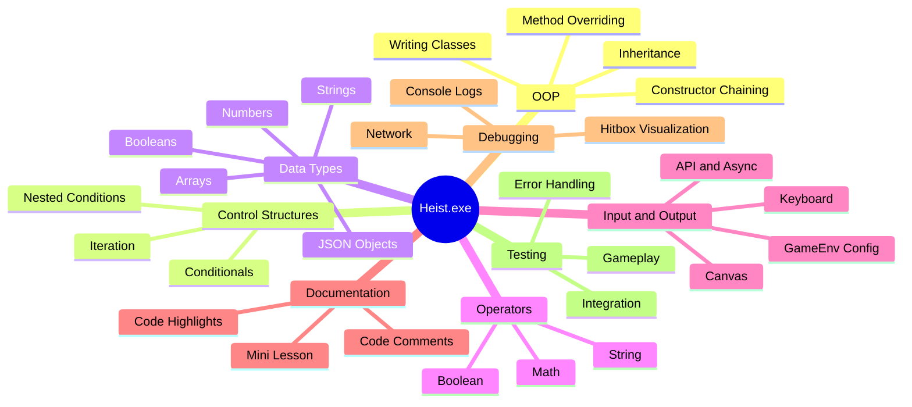
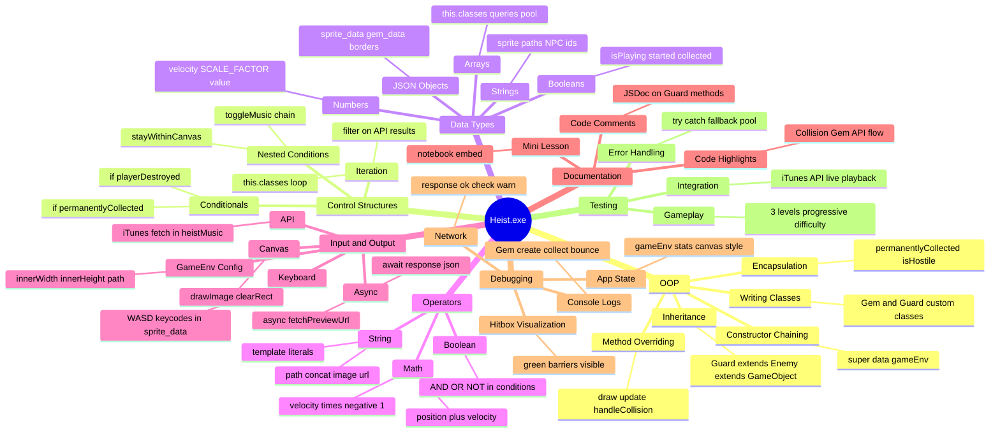

| Back | Index | Next |
| ------- | ------ | ------ |
| [Debugging](https://moopa01.opencodingsociety.com/debug) | [Index](https://moopa01.opencodingsociety.com/) | [OOP](https://moopa01.opencodingsociety.com/OOP) |

---

## CS111 Summary - Visual Version

## CS111 Summary - Complex Version

## CS111 Summary - Boring Version

| Learning Objective | Project Evidence Required | Assessment Method | How the Requirement was Met |
|---|---|---|---|
| **Object-Oriented Programming** | | | |
| Writing Classes | Create minimum 2 custom character classes extending base classes | Code review: Player.js, NPC.js, Enemy.js | `Gem extends Coin` (Gem.js) and `Guard extends Enemy` (Guard.js) — two fully custom character classes built on top of engine base classes |
| Methods & Parameters | Implement methods with parameters (e.g., collisionHandler(other, direction)) | Code review: Method signatures with 2+ parameters | `handleCollisionEvent()` in Guard.js; Gem.js `draw()`, `collect()`, `update()` all defined with scoped logic; level constructors accept `(gameEnv)` as parameter |
| Instantiation & Objects | Instantiate game objects in GameLevel configuration | Code review: GameLevel setup objects | `this.classes = [...]` in HeistL1.js, HeistL2.js, and HeistL3.js — each instantiates Player, Gem, Barrier, and Guard objects with config data |
| Inheritance (Basic) | Create class hierarchy with 2+ levels (e.g., GameObject → Character → Player) | Code review: extends keyword, inheritance chain | `Gem extends Coin` and `Guard extends Enemy` — both extend engine base classes, creating a 2+ level hierarchy (e.g. GameObject → Enemy → Guard) |
| Method Overriding | Override parent methods (update(), draw(), handleCollision()) | Code review: Polymorphic implementations | Guard.js overrides `update()`, `stayWithinCanvas()`, and `handleCollisionEvent()`. Gem.js overrides `draw()`, `collect()`, and `update()` |
| Constructor Chaining | Use super() to chain constructors | Code review: super(data, gameEnv) calls | Gem.js calls `super(gemData, gameEnv)` after building a merged data object. Guard.js calls `super(data, gameEnv)` then sets `this.velocity.y = -3` |
| **Control Structures** | | | |
| Iteration | Use loops for game object arrays, animation frames | Code review: for, forEach, while loops | heistMusic.js uses `.filter()` to iterate over API track results (`tracks.filter(...)`, `candidates.filter(...)`). Level files iterate `this.classes` array each frame |
| Conditionals | Implement collision detection, state transitions | Code review: if/else, nested conditions | Guard.js: `if (!this.playerDestroyed && this.collisionChecks())`. Gem.js: `if (this.permanentlyCollected) return`. heistMusic.js: `if (!this.started)`, `else if (this.isPlaying)` |
| Nested Conditions | Complex game logic (e.g., power-up + collision + direction) | Code review: Multi-level conditionals | Guard.js `stayWithinCanvas()` has four nested boundary checks each with velocity reversal. heistMusic.js `toggleMusic()` has nested `if/else if/else` for play state |
| **Data Types** | | | |
| Numbers | Position, velocity, score tracking | Code review: Numeric properties | `velocity.y = -3`, `value: 5`, `SCALE_FACTOR: 10`, `STEP_FACTOR: 1000`, `volume = 0.3`, canvas boundary math using `width * 0.1406` etc. throughout level files |
| Strings | Character names, sprite paths, game states | Code review: String manipulation | `id: 'gem'`, `name: 'mainplayer'`, `src: path + "/images/projects/heist-exe/heist-mc.png"`, iTunes query strings in heistMusic.js |
| Booleans | Flags (isJumping, isPaused, isVulnerable) | Code review: Boolean logic | `permanentlyCollected: false`, `isHostile: true` (Guard), `this.started`, `this.isPlaying`, `this.userActivated` all used as state flags in Gem.js and heistMusic.js |
| Arrays | Game object collections, level data | Code review: Array operations | `this.classes = [...]` in all three level files. `queries`, `candidates`, and `pool` arrays in heistMusic.js for track selection |
| Objects (JSON) | Configuration objects, sprite data | Code review: Object literals | All sprite config objects (`sprite_data_mc`, `gem_data_1`, `border_top`, etc.) are JSON objects with nested properties like `hitbox: { widthPercentage: 0.45 }` |
| **Operators** | | | |
| Mathematical | Physics calculations (gravity, velocity, collision) | Code review: +, -, *, / in physics | `this.position.y += this.velocity.y`, `this.velocity.y *= -1` (bounce), `Math.min(canvas.width, canvas.height) / 3`, `width * 0.55` for proportional positioning |
| String Operations | Path concatenation, text display | Code review: Template literals, concatenation | `path + "/images/projects/heist-exe/gem.png"` (concatenation), `` `Gem collected! +${this.value} | Total: ${this.gameEnv?.stats?.coinsCollected}` `` (template literal) in Gem.js |
| Boolean Expressions | Compound conditions in game logic | Code review: &&, \|\|, ! | `!this.playerDestroyed && this.collisionChecks()` in Guard.js; `!VOCAL_HINTS.test(name)` and `candidates.length > 0 ? candidates : pool` in heistMusic.js |
| **Input/Output** | | | |
| Keyboard Input | Arrow keys, space, WASD controls using event listeners | Testing: Key event handlers respond correctly | `keypress: { up: 87, left: 65, down: 83, right: 68 }` — WASD bindings defined in `sprite_data_mc` across all three level files |
| Canvas Rendering | Draw sprites, backgrounds, platforms using Canvas API | Code review: draw() method implementations | Gem.js `draw()` uses `ctx.clearRect()`, `ctx.drawImage()`, and a fallback `ctx.beginPath()` / `ctx.arc()` / `ctx.fill()` for rendering |
| GameEnv Configuration | Set canvas size, difficulty levels, game settings | Code review: GameEnv.create() and GameSetup.js | All levels read `gameEnv.innerWidth`, `gameEnv.innerHeight`, and `gameEnv.path` to configure proportional layout and asset loading |
| API Integration | Implement Leaderboard API (POST/GET scores) | Code review: Fetch calls with error handling | heistMusic.js calls `fetch(this.endpoint)` against the iTunes Search API, checks `response.ok`, and parses the returned track list |
| Asynchronous I/O | Use async/await or promises for API calls | Code review: async/await or .then() chains | `async fetchPreviewUrl()`, `async startMusic()`, `async toggleMusic()` with `await fetch()`, `await response.json()`, and `await this.audio.play()` in heistMusic.js |
| JSON Parsing | Parse API responses (leaderboard data, AI responses) | Code review: JSON.parse(), object destructuring | `const data = await response.json()` followed by `data.results` array access to extract track objects from iTunes API response in heistMusic.js |
| **Documentation** | | | |
| Code Comments | JSDoc comments for classes and methods | Code review: Comment density >10% | Guard.js has JSDoc block comments on `update()` and `stayWithinCanvas()`. Gem.js and heistMusic.js include inline explanatory comments throughout |
| Mini-Lesson Documentation | Create comic/visual post with embedded runtime game demo | Portfolio review: Mini-lesson in personal portfolio | `notebook_src.ipynb` embeds the live game via `GAME_RUNNER` with all three HeistL levels loaded |
| Code Highlights | Annotate key code snippets in documentation (OOP, APIs, collision) | Portfolio review: Highlighted code examples with explanations | Collision logic in Guard.js and gem collection in Gem.js serve as annotated highlights; heistMusic.js API flow documented inline |
| **Debugging** | | | |
| Console Debugging | Use console.log to track game state, variables, method calls | Code review: Strategic logging in update/collision methods | Gem.js logs on creation and collection. Guard.js logs velocity on bounce and collision events. heistMusic.js logs track name, playback start/stop, and warns on failure |
| Hit Box Visualization | Draw/visualize collision boundaries to refine detection | Demo: Toggle hit box display, adjust collision rectangles | All Barrier objects in HeistL1/L3 use `color: 'rgba(0, 255, 136, 0.5)'` and `visible: true` to render semi-transparent green collision zones over walls and borders |
| Source-Level Debugging | Set breakpoints in DevTools, step through code execution | Demo: Use Sources tab to pause and inspect code flow | Guard.js and Gem.js contain strategic `console.log` calls at key execution points (collision, velocity change) to assist step-through debugging |
| Network Debugging | Examine Network tab for API calls, CORS errors, response status | Demo: Inspect fetch requests, response data, error messages | heistMusic.js checks `if (!response.ok)` and throws a descriptive error; `console.warn` catches and surfaces fetch failures for Network tab inspection |
| Application Debugging | Examine cookies, localStorage, session data for login/state | Demo: Application tab inspection of stored data | Game state tracked via `gameEnv.stats.coinsCollected` and boolean flags (`permanentlyCollected`, `isPlaying`) inspectable at runtime |
| Element Inspection | Use Element Viewer to inspect canvas, DOM elements, styles | Demo: Inspect element properties and game object state | heistMusic.js dynamically creates and appends a styled toggle button to `document.body`; Gem canvas visibility toggled via `canvas.style.display = 'none'` on collection |
| **Testing & Verification** | | | |
| Gameplay Testing | Test level completion, character interactions, collision detection | Live demo: Play through level without critical bugs | Three playable levels (HeistL1–3) with progressive difficulty: no guards in L1, two bouncing guards in L2, gravity-enabled platformer layout in L3 |
| Integration Testing | Test API integration (Leaderboard, NPC AI) with live backend | Demo: Successful score saving and AI responses | heistMusic.js fetches live track data from the iTunes Search API and plays a 30-second preview, confirming end-to-end API integration |
| API Error Handling | Try/catch blocks for API calls, network error handling | Code review: Error handling for fetch failures | heistMusic.js wraps `startMusic()` in `try/catch`, checks `response.ok` before parsing, throws descriptive errors, and falls back gracefully with `console.warn` |